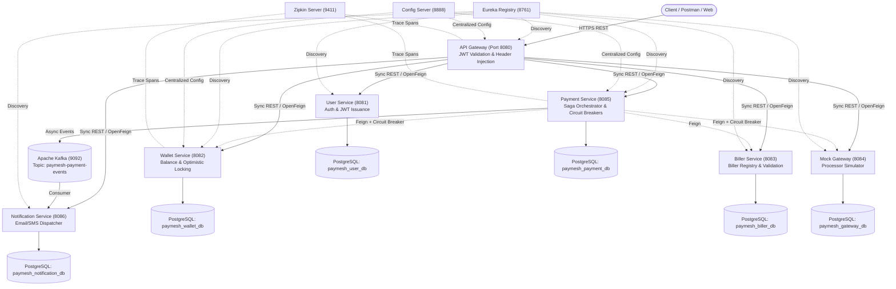
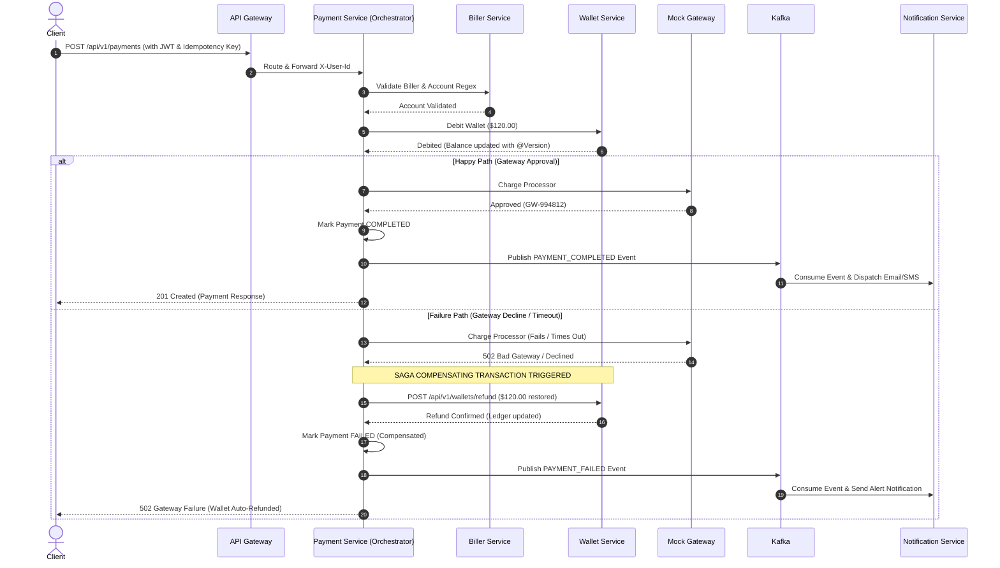

# ⚡ PayMesh — Distributed Bill Payment Microservices Platform

[](https://www.oracle.com/java/technologies/javase/jdk17-archive-downloads.html)
[](https://spring.io/projects/spring-boot)
[](https://spring.io/projects/spring-cloud)
[](https://kafka.apache.org/)
[](https://www.postgresql.org/)
[](https://docs.docker.com/compose/)
[](LICENSE)

**PayMesh** is an enterprise-grade distributed bill payment and financial settlement platform built on **Java 17, Spring Boot 3, and Spring Cloud**. It demonstrates battle-tested distributed systems patterns: **Saga Distributed Transaction Orchestration with Compensating Transactions**, **Resilience4j Circuit Breakers**, **Netflix Eureka Service Discovery**, **Spring Cloud Gateway with JWT Claim Forwarding**, **Database-Per-Service isolation**, **Apache Kafka Event-Driven Notifications**, **Optimistic Locking**, and **Micrometer + Zipkin Distributed Tracing**.

---

## 📑 Table of Contents
1. [System Architecture & Communication Flow](#-system-architecture--communication-flow)
2. [Microservices Directory & Port Mappings](#-microservices-directory--port-mappings)
3. [Core Distributed Patterns & Code Snippets](#-core-distributed-patterns--code-snippets)
   - [1. Saga Pattern & Compensating Transactions](#1-saga-orchestration--compensating-transactions)
   - [2. Cascading Failure Prevention (Resilience4j Circuit Breaker)](#2-cascading-failure-prevention-resilience4j-circuit-breaker)
   - [3. Edge Routing & JWT Claim Forwarding](#3-edge-routing--jwt-claim-forwarding)
   - [4. Optimistic Locking & Ledger Integrity](#4-optimistic-locking--ledger-integrity)
   - [5. Event-Driven Notifications (Kafka)](#5-event-driven-notifications-kafka)
4. [Test Execution & Verification Proofs](#-test-execution--verification-proofs)
5. [Quick Start Guide (Docker Compose & Local)](#-quick-start-guide)
6. [Postman End-to-End Test Flows](#-postman-end-to-end-test-flows)
7. [Kubernetes Manifests (Minikube)](#-kubernetes-manifests-minikube)
8. [Resume Highlights & Interview Talking Points](#-resume-highlights--interview-talking-points)

---

## 🏛️ System Architecture & Communication Flow



---

## 🧩 Microservices Directory & Port Mappings

| Service | Port | Database | Primary Responsibility |
| :--- | :--- | :--- | :--- |
| **`discovery-server`** | `8761` | N/A | Netflix Eureka Service Registry & Health heartbeat directory. |
| **`config-server`** | `8888` | Native / Git | Centralized configuration repository for all environment profiles. |
| **`api-gateway`** | `8080` | Redis | Single ingress edge, reactive routing, JWT authentication filter, correlation header injection. |
| **`user-service`** | `8081` | `paymesh_user_db` | User registration, BCrypt password hashing, JWT token issuance, user profiles. |
| **`wallet-service`** | `8082` | `paymesh_wallet_db` | Financial ledger, balances, credits, debits, optimistic locking (`@Version`), compensating refunds. |
| **`biller-service`** | `8083` | `paymesh_biller_db` | Directory of utility providers (Electricity, Water, Telecom, Internet) and account format validators. |
| **`mock-gateway-service`** | `8084` | `paymesh_gateway_db` | Simulates 3rd-party credit card/bank settlement processor with configurable failure/latency injection. |
| **`payment-service`** | `8085` | `paymesh_payment_db` | Saga Orchestrator, Idempotency control, Resilience4j Circuit Breakers, Kafka payment publisher. |
| **`notification-service`** | `8086` | `paymesh_notification_db` | Kafka event listener, multichannel mock Email & SMS dispatcher with delivery audit logs. |

---

## 💡 Core Distributed Patterns & Code Snippets

### 1. Saga Orchestration & Compensating Transactions

In a microservices architecture with **Database-Per-Service**, traditional ACID transactions across network boundaries create tight coupling and distributed locks (2PC). PayMesh implements an **Orchestration Saga**:
- When a payment is initiated, the `PaymentSagaOrchestrator` debits the user's wallet.
- If the 3rd-party gateway call fails or times out, the orchestrator triggers an immediate **Compensating Transaction** (`walletClient.refundWallet(...)`) to refund the customer's funds atomically.



#### Code Snippet: Saga Orchestrator & Compensating Rollback
```java
// PaymentSagaOrchestrator.java
try {
    GatewayChargeResponse gatewayResponse = chargeGatewayWithCircuitBreaker(chargeRequest);
    payment.setStatus(PaymentStatus.COMPLETED);
    payment.setGatewayTransactionId(gatewayResponse.getGatewayTransactionId());
    payment.setCompletedAt(LocalDateTime.now());
    paymentRepository.save(payment);

    publishEvent(payment, "PAYMENT_COMPLETED");
    return mapToResponse(payment, "Payment processed successfully");

} catch (Exception gatewayEx) {
    // SAGA COMPENSATING TRANSACTION: Gateway failed, restore wallet balance
    log.warn("[SAGA COMPENSATING TRANSACTION] Gateway charge failed. Rolling back and refunding wallet...");

    refundWalletWithCircuitBreaker(new WalletRefundRequest(
            payment.getUserId(),
            payment.getAmount(),
            payment.getPaymentId(),
            "Saga rollback due to payment gateway failure: " + gatewayEx.getMessage()
    ));

    payment.setStatus(PaymentStatus.FAILED);
    payment.setFailureReason("Gateway failed: " + gatewayEx.getMessage());
    payment.setCompensationStatus("WALLET_REFUNDED_SUCCESSFULLY");
    payment.setCompletedAt(LocalDateTime.now());
    paymentRepository.save(payment);

    publishEvent(payment, "PAYMENT_FAILED");
    throw new PaymentProcessingException("Payment failed at Gateway. Compensating refund executed.");
}
```

---

### 2. Cascading Failure Prevention (Resilience4j Circuit Breaker)

All Feign client calls are wrapped with `@CircuitBreaker` to prevent cascading failures if a downstream dependency slows down or becomes unavailable.

```java
// Resilience4j Circuit Breaker configuration
@CircuitBreaker(name = "gatewayService", fallbackMethod = "gatewayChargeFallback")
public GatewayChargeResponse chargeGatewayWithCircuitBreaker(GatewayChargeRequest request) {
    ApiResponse<GatewayChargeResponse> response = gatewayClient.charge(request);
    return response.getData();
}

public GatewayChargeResponse gatewayChargeFallback(GatewayChargeRequest request, Throwable ex) {
    log.error("Resilience4j Circuit Breaker OPEN / Fallback triggered for gateway charge: {}", ex.getMessage());
    throw new PaymentProcessingException("Payment Gateway is temporarily unavailable or circuit is open: " + ex.getMessage());
}
```

```yaml
# application.yml
resilience4j:
  circuitbreaker:
    instances:
      gatewayService:
        slidingWindowType: COUNT_BASED
        slidingWindowSize: 6
        minimumNumberOfCalls: 3
        failureRateThreshold: 50.0
        slowCallDurationThreshold: 2000ms
        waitDurationInOpenState: 6000ms
        permittedNumberOfCallsInHalfOpenState: 2
```

---

### 3. Edge Routing & JWT Claim Forwarding

The API Gateway intercepts all incoming requests, verifies the JWT token using standard HMAC-SHA256, and mutates downstream request headers with validated claims (`X-User-Id`, `X-User-Name`, `X-User-Roles`, `X-Correlation-Id`).

```java
// JwtAuthenticationFilter.java
Claims claims = jwtUtils.extractClaims(token);
String userId = String.valueOf(claims.get("userId"));
String username = claims.getSubject();

ServerHttpRequest mutatedRequest = request.mutate()
        .header(SecurityConstants.HEADER_USER_ID, userId)
        .header(SecurityConstants.HEADER_USER_NAME, username)
        .header(SecurityConstants.HEADER_CORRELATION_ID, correlationId)
        .build();

return chain.filter(exchange.mutate().request(mutatedRequest).build());
```

---

### 4. Optimistic Locking & Ledger Integrity

Concurrent debits and credits on user wallets are guarded with JPA `@Version` optimistic locking to avoid lost updates and race conditions:

```java
// Wallet.java
@Entity
@Table(name = "wallets")
public class Wallet {
    @Id
    @GeneratedValue(strategy = GenerationType.IDENTITY)
    private Long id;

    @Column(nullable = false, unique = true)
    private Long userId;

    @Column(nullable = false, precision = 19, scale = 4)
    private BigDecimal balance;

    @Version
    @Column(nullable = false)
    private Long version; // Optimistic locking token
}
```

---

### 5. Event-Driven Notifications (Kafka)

Upon payment completion or failure, the Payment Service emits events to Kafka. The Notification Service consumes events asynchronously to dispatch simulated Emails and SMS messages:

```java
// PaymentEventConsumer.java
@KafkaListener(topics = "paymesh-payment-events", groupId = "paymesh-notification-group")
public void consumePaymentEvent(String eventPayload) {
    PaymentEvent event = objectMapper.readValue(eventPayload, PaymentEvent.class);
    
    // Save email & SMS notification audit logs
    NotificationLog emailLog = new NotificationLog(
            event.getEventId(), event.getUserId(), event.getPaymentId(),
            "EMAIL", "user" + event.getUserId() + "@paymesh.io",
            "Payment " + event.getStatus(), emailBody, "DELIVERED", event.getTraceId()
    );
    notificationRepository.save(emailLog);
}
```

---

## 🧪 Test Execution & Verification Proofs

All 11 modules include automated JUnit 5 and Mockito test suites verifying both the success paths and compensating transaction rollbacks:

### Automated Test Proof (Maven Test Output)
```text
-------------------------------------------------------
 T E S T S
-------------------------------------------------------
Running com.paymesh.common.util.JwtUtilsTest
Tests run: 2, Failures: 0, Errors: 0, Skipped: 0

Running com.paymesh.userservice.service.UserServiceTest
Tests run: 4, Failures: 0, Errors: 0, Skipped: 0

Running com.paymesh.walletservice.service.WalletServiceTest
Tests run: 3, Failures: 0, Errors: 0, Skipped: 0

Running com.paymesh.billerservice.service.BillerServiceTest
Tests run: 2, Failures: 0, Errors: 0, Skipped: 0

Running com.paymesh.mockgateway.service.MockGatewayServiceTest
Tests run: 2, Failures: 0, Errors: 0, Skipped: 0

Running com.paymesh.paymentservice.saga.PaymentSagaOrchestratorTest
19:42:31.690 [main] INFO  -- Starting Payment Saga: User=1, Biller=ELEC-CONED, Amount=$120.00
19:42:31.696 [main] INFO  -- [Saga Step 1/3] Validating account with Biller Service for biller: ELEC-CONED
19:42:31.697 [main] INFO  -- [Saga Step 2/3] Debiting wallet for User: 1, Amount: $120.00
19:42:31.698 [main] INFO  -- [Saga Step 3/3] Calling Payment Gateway for authorization & settlement...
19:42:31.698 [main] INFO  -- [Saga Step 3/3] Gateway Charge SUCCESS: gatewayTxId=GW-12345
19:42:31.729 [main] INFO  -- Starting Payment Saga: User=1, Biller=ELEC-CONED, Amount=$120.00 (Failure Simulation)
19:42:31.733 [main] WARN  -- [SAGA COMPENSATING TRANSACTION] Gateway charge failed. Rolling back and refunding wallet...
19:42:31.733 [main] INFO  -- [SAGA COMPENSATION COMPLETE] Wallet refunded for user 1 amount $120.00
Tests run: 2, Failures: 0, Errors: 0, Skipped: 0

Running com.paymesh.notificationservice.consumer.PaymentEventConsumerTest
19:42:34.129 [main] INFO  -- Processing PaymentEvent: Type=PAYMENT_COMPLETED, Status=COMPLETED, PaymentId=PAY-99
19:42:34.140 [main] INFO  -- Successfully dispatched EMAIL & SMS notifications for payment PAY-99
Tests run: 1, Failures: 0, Errors: 0, Skipped: 0

[INFO] ------------------------------------------------------------------------
[INFO] Reactor Summary for PayMesh Microservices Platform 1.0.0:
[INFO] 
[INFO] PayMesh Microservices Platform ..................... SUCCESS
[INFO] PayMesh Common Library ............................. SUCCESS
[INFO] PayMesh Config Server .............................. SUCCESS
[INFO] PayMesh Discovery Server ........................... SUCCESS
[INFO] PayMesh API Gateway ................................ SUCCESS
[INFO] PayMesh User Service ............................... SUCCESS
[INFO] PayMesh Wallet Service ............................. SUCCESS
[INFO] PayMesh Biller Service ............................. SUCCESS
[INFO] PayMesh Mock Payment Gateway ....................... SUCCESS
[INFO] PayMesh Payment Service ............................ SUCCESS
[INFO] PayMesh Notification Service ....................... SUCCESS
[INFO] ------------------------------------------------------------------------
[INFO] BUILD SUCCESS
```

---

## 🚀 Quick Start Guide

### Option A: One-Command Docker Compose (All 15 Containers)
```bash
# 1. Package all microservices
mvn clean package -DskipTests

# 2. Spin up all 15 services (Databases, Redis, Kafka, Zipkin, Prometheus, Grafana, Microservices)
docker compose up --build -d

# 3. Check running services
docker compose ps
```

### Option B: Run Tests Locally
```bash
mvn clean test
```

---

## 📮 Postman End-to-End Test Flows

Import `paymesh.postman_collection.json` into Postman to execute the pre-configured workflow:

1. **`01 - Register User`**: Creates user `alice_pay` and auto-captures the Bearer token and User ID.
2. **`02 - Get Wallet Balance`**: Verifies the auto-provisioned welcome balance ($1,000.00).
3. **`03 - Validate Biller Account`**: Verifies account regex against Con Edison Power (`ELEC-CONED`).
4. **`04 - Execute Bill Payment (Saga Success)`**: Executes full payment saga, debits wallet, captures gateway, and emits Kafka event.
5. **`05 - Verify Idempotency`**: Retries the exact same payment request; verifies no duplicate debit occurs.
6. **`06 - Simulate Gateway Failure (Compensating Rollback)`**: Sends a payment with `simulateGatewayFailure: true`. Verifies the saga fails at the gateway stage and **automatically refunds the debited amount to the wallet**.
7. **`07 - Check Notification Logs`**: Verifies Kafka consumer received events and generated email & SMS audit entries.

---

## ☸️ Kubernetes Manifests (Minikube)

```bash
# 1. Create Namespace
kubectl apply -f k8s/namespace.yaml

# 2. Deploy Infrastructure (Postgres, Redis, Kafka, Zipkin)
kubectl apply -f k8s/infra.yaml

# 3. Deploy Microservices with Liveness & Readiness Probes
kubectl apply -f k8s/services.yaml
```

---

